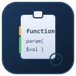

# CodeBlock-Manager für VS Code

<p align="center">
  
</p>

<p align="center">
  <a href="https://github.com/RoccoAmmon/CodeBlock-Manager-VSC/releases">
    
  </a>
  <a href="https://github.com/RoccoAmmon/CodeBlock-Manager-VSC/releases">
    
  </a>
  <a href="https://github.com/RoccoAmmon/CodeBlock-Manager-VSC">
    
  </a>
  <a href="https://github.com/RoccoAmmon/CodeBlock-Manager-VSC/blob/main/LICENSE">
    
  </a>
</p>


Tauscht Code-Bloecke (`function`, `class`, `def`, `enum`, uvm.) **sprachübergreifend live im Editor** aus der Zwischenablage aus – mit Diff-Vorschau, Kommentar-Erhalt, automatischer Einrückung, Sicherung **und Block-Navigator in der Sidebar**.

## 📖 Anleitung

### Grundlegende Verwendung

1. **Eine unterstützte Datei** (`.ps1`, `.py`, `.js`, `.ts`, `.cs`, `.java`, `.go`, `.rb`, `.rs`, `.php`, `.cpp`) im Editor öffnen.
2. Einen Block kopieren – z. B. eine ganze Funktion mit **Strg+C**.
3. **`Strg+Alt+V`** drücken (oder Befehlspalette → „CodeBlock: Funktion aus Zwischenablage einfügen").

Das Plugin:
- Erkennt den Block (Name, Klammern, Kommentare)
- Sucht nach einem gleichnamigen Block in der geöffneten Datei
- **Zeigt ein Diff-Fenster** (alt ↔ neu) mit „Übernehmen / Verwerfen"
- Ersetzt den Block **inklusive vorherigem Kommentarblock** (z. B. `<# .SYNOPSIS … #>`)
- **Passt die Einrückung** automatisch an die Zieltiefe an
- Erstellt eine **`.bak`-Sicherung** der Datei
- **Springt** zur geänderten Stelle und **markiert** sie farbig
- Blendet die Markierung **nach 5 Sekunden** (oder bei Tasteneingabe) aus

> **Tipp:** Du kannst auch mehrere Blöcke auf einmal kopieren – alle werden nacheinander ersetzt bzw. angehängt.

### Live-Modus

Schaltet die Statusleiste auf **„Live AN"** (Klick auf das Auge-Symbol). Das Plugin **überwacht dann die Zwischenablage sekündlich** und ersetzt automatisch, sobald ein PowerShell-Block erkannt wird. Ideal beim Arbeiten mit mehreren Editoren oder Remote-Sitzungen.

### Anhängen neuer Blöcke

Wenn ein Block in der aktuellen Datei noch nicht existiert, wird er **ans Ende der Datei angehängt** (einstellbar). So kannst du schnell mehrere neue Funktionen aus dem Clipboard sammeln.

---

## ⚙️ Alle Funktionen (Feature-Übersicht)

| # | Funktion | Beschreibung |
|---|----------|--------------|
| 🌍 | **Sprachübergreifend** | Unterstützt PowerShell, Python, JavaScript, TypeScript, C#, Java, Go, Ruby, Rust, PHP, C/C++ |
| 🔄 | **Block ersetzen** | Erkennt Blöcke (`function`, `def`, `class`, `fn`, `func`, uvm.) aus der Zwischenablage |
| 👀 | **Diff-Vorschau** | Zeigt alt ↔ neu vor dem Ersetzen; „Übernehmen" oder „Verwerfen" per Klick |
| 💬 | **Kommentar-Erhalt** | Vorangehende Kommentare (`#`, `//`, `/* */`, `<# #>`, `'''`) werden mit ersetzt |
| 📐 | **Einrückung anpassen** | Eingefügter Code übernimmt die Einrückungstiefe der Zielstelle |
| 🌲 | **Block-Navigator (Sidebar)** | Alle Blöcke der aktuellen Datei im TreeView; Klick = Navigation, Rechtsklick = Ersetzen |
| 🎯 | **Sprung zur Änderung** | Cursor springt nach dem Ersetzen direkt zur ersten geänderten Stelle |
| 💾 | **Auto-Backup** | Vor jeder Ersetzung wird eine `.bak`-Datei neben der Originaldatei erstellt |
| 🟡🟢 | **Farbige Markierung** | Gelb = ersetzt, Grün = angehängt; blendet nach X s oder bei Eingabe aus |
| 📚 | **Mehrfach-Modus** | Beliebig viele Blöcke auf einmal kopieren und ersetzen/anhängen |
| ➕ | **Anhängen** | Neue Blöcke werden ans Ende der Datei angehängt |
| 👁️ | **Live-Überwachung** | Überwacht die Zwischenablage und ersetzt automatisch |
| ↩️ | **Undo-fähig** | Alle Änderungen sind ein einziger Undo-Schritt (Strg+Z) |

---

## ⚙️ Einstellungen

Öffnen über: **Datei → Einstellungen → Erweiterungen → CodeBlock-Manager** oder `settings.json`:

| Einstellung | Standard | Beschreibung |
|-------------|----------|--------------|
| `codeblockManager.vorschauDiff` | `true` | Diff-Fenster (alt ↔ neu) vor dem Ersetzen anzeigen |
| `codeblockManager.autoBackup` | `true` | Automatische `.bak`-Sicherung vor jeder Ersetzung |
| `codeblockManager.kommentareEinbeziehen` | `true` | Kommentarblock / Comment-Based-Help oberhalb mit-ersetzen |
| `codeblockManager.markierungTimeoutSek` | `5` | Sekunden bis Markierung ausgeblendet wird (`0` = nie) |
| `codeblockManager.neueFunktionenAnhaengen` | `true` | Unbekannte Blöcke ans Dateiende anhängen |
| `codeblockManager.liveUeberwachung` | `false` | Zwischenablage automatisch überwachen (auch beim Start) |

---

## ⌨️ Befehle & Tastenkürzel

| Befehl | Tastenkürzel | Beschreibung |
|--------|-------------|--------------|
| `codeblockManager.funktionErsetzen` | `Strg+Alt+V` | Block aus Zwischenablage einfügen/ersetzen |
| `codeblockManager.liveToggle` | Statusleiste (Klick) | Live-Überwachung ein-/ausschalten |
| `codeblockManager.markierungenLoeschen` | — | Gelbe/grüne Markierungen manuell entfernen |
| `codeblockManager.navigiereZuBlock` | TreeView (Klick) | Zu Block im Code springen |
| `codeblockManager.ersetzteBlockAusTree` | TreeView (Rechtsklick) | Block aus Zwischenablage ersetzen |

---

## 🛡️ Sicherheit

- **Keine Netzwerkzugriffe** – das Plugin arbeitet rein lokal
- **Keine Dateimanipulation ohne Bestätigung** – Diff-Vorschau verhindert versehentliches Überschreiben
- **Backup vor jeder Änderung** – die `.bak`-Datei liegt neben der bearbeiteten Datei

---

## 🌍 Unterstützte Sprachen

| Sprache | Erweiterungen | Erkannte Blöcke |
|---------|---------------|-----------------|
| PowerShell | `.ps1`, `.psm1`, `.psd1` | `function`, `filter`, `workflow`, `configuration`, `class`, `enum` |
| Python | `.py`, `.pyw` | `def`, `class`, `async def` |
| JavaScript | `.js`, `.jsx`, `.mjs`, `.cjs` | `function`, `class`, `async function` |
| TypeScript | `.ts`, `.tsx`, `.mts`, `.cts` | `function`, `class`, `async function` |
| C# | `.cs` | `class`, `struct`, `interface`, `enum`, `record` |
| Java | `.java` | `class`, `interface`, `enum`, `record` |
| Go | `.go` | `func`, `type` |
| Ruby | `.rb`, `.ruby` | `def`, `class`, `module` |
| Rust | `.rs` | `fn`, `struct`, `enum`, `trait`, `impl` |
| PHP | `.php` | `function`, `class`, `interface`, `trait`, `enum` |
| C/C++ | `.cpp`, `.cxx`, `.cc`, `.c`, `.h`, `.hpp` | `class`, `struct`, `enum` |

> 💡 **Neue Sprache gewünscht?** Einfach in `src/blockPatterns.ts` eine neue `LanguageConfig` hinzufügen!

---

## 💡 Anwendungsbeispiele

**Beispiel 1: Funktion aktualisieren**
```powershell
# Alte Funktion in der Datei:
function Get-Info { return "alt" }

# Neue Version kopiert:
function Get-Info { return "neu" }

# Strg+Alt+V → Diff prüfen → Übernehmen → fertig
```

**Beispiel 2: Comment-Based-Help ersetzen**
```powershell
<#
.SYNOPSIS
  Alte Beschreibung
#>
function Do-Something { ... }

# Kopierte Version (Help + Code):
<#
.SYNOPSIS
  Neue Beschreibung
#>
function Do-Something { ... }

# Strg+Alt+V → beides wird ersetzt, keine doppelten Hilfetexte
```

**Beispiel 3: Klasse ersetzen**
```powershell
class Person {
    [string]$Name
}
# Kopierte Version → Strg+Alt+V
class Person {
    [string]$Name
    [int]$Age
}
```

**Beispiel 4: Python-Funktion ersetzen**
```python
# Alte Funktion:
def calculate(x, y):
    return x + y

# Kopiert:
def calculate(x, y):
    """Berechnet das Produkt"""
    return x * y

# Strg+Alt+V → Diff prüfen → Übernehmen → fertig
```

**Beispiel 5: TypeScript-Klasse ersetzen**
```typescript
// Alte Klasse:
class User {
    name: string;
}

// Kopiert:
class User {
    name: string;
    email: string;
    constructor(name: string, email: string) {
        this.name = name;
        this.email = email;
    }
}

// Strg+Alt+V → übernehmen
```

---

## 🔧 Entwicklung

```powershell
npm install       # Abhängigkeiten installieren
npm run compile   # TypeScript kompilieren
npm run package   # VSIX-Paket bauen
F5                # Extension Development Host starten
```

> **Hinweis:** Node.js muss im PATH sein, sonst direkt `& 'C:\Program Files\nodejs\node.exe' node_modules/typescript/bin/tsc -p ./` verwenden.

Das VSIX-Paket kann manuell über die Extensions-Ansicht („Aus VSIX installieren…") oder via Marketplace bezogen werden.

---

## 📦 Release-Workflow (GitHub Actions)

Bei Push eines Tags `v*` wird automatisch:
1. Die Extension kompiliert
2. Ein VSIX-Paket gebaut
3. Ein GitHub-Release mit VSIX erstellt
4. (optional) Im VS Code Marketplace veröffentlicht

```powershell
git tag v1.1.0
git push origin v1.1.0
```

---

## 📜 Changelog

Siehe [CHANGELOG.md](CHANGELOG.md) für alle Versionen und Änderungen.
